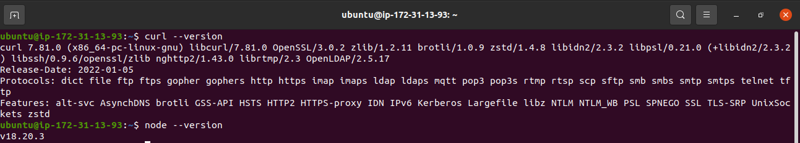

## Task 

#### Aim: Create custom AMI of AWS ec2 with HashiCorp packer where script based software installation will run.

1. install Node.js, curl, maven, jq, zip
2. install python3 latest version, AWS CLI latest version, yarn, zip, curl, java version 17.


### Step 1:

+ First of all we are going to ensure the installation of packer so that we can use the hashicorp packer for further process

```bash
curl -fsSL https://apt.releases.hashicorp.com/gpg  | sudo gpg --dearmor -o /etc/apt/trusted.gpg.d/hashicorp.gpg
```

+ This command uses curl to fetch the GPG key for HashiCorp releases from 

+ https://apt.releases.hashicorp.com/gpg.

+ -fsSL flags for curl mean:

- -f: Fail silently on server errors.
- -s: Silent mode (don't show progress meter or error messages).
- -S: Show error messages if they occur.
- -L: Follow redirects.

+ This ensures that the GPG key is fetched securely and silently and at very next sudo command it store the value to given path in binary format which is (-o) mentioned before the path


+ Purpose: This step adds HashiCorp's GPG key to the list of trusted keys used by APT to verify packages.


> sudo apt-add-repository "deb [arch=amd64] https://apt.releases.hashicorp.com $(lsb_release -cs) main"

+ Purpose: This step adds the HashiCorp repository to APT's list of repositories so that APT knows where to find HashiCorp packages.

> sudo apt update && sudo apt install packer

+ Purpose: This step ensures that the package list is up-to-date and installs the packer tool from the HashiCorp repository

> packer --version

+ Purpose: This step is to verify the installation has been done successfully with a newer version.


### Step 2:

+ we will first create two scripts where we have to perform the installation task in ec2 so before creating any file we will create two script as given us in the aim


```bash
#!/bin/bash

#script 1

sudo apt update

sudo apt install -y curl maven jq zip

curl -fsSL https://deb.nodesource.com/setup_18.x | sudo -E bash -

sudo apt-get install -y nodejs
```

+ the above script is performing the installation of Curl, Maven , Jq , Zip and node-js


```bash
#!/bin/bash

# Script 2

sudo apt update
sudo apt install -y python3

sudo apt remove awscli
sudo apt update

curl "https://awscli.amazonaws.com/awscli-exe-linux-x86_64.zip" -o "awscli-exe-linux-x86_64.zip"
unzip awscli-exe-linux-x86_64.zip
sudo ./awscli-exe-linux-x86_64/aws/install

sudo apt update
sudo apt install -y openjdk-17-jdk
```

+ The above script is performing the installation of python, aws-cli, jdk-17 with a newer version specified in the file


### step 3:

+ so now it is time to create a file to build a customize AMI image at aws ec2 instance with hashicorp packer where script based software installation will run.

+ First block which we define is about required plugins of packer to run so that we can create with specified requirements in the program

+ packer block: This block defines configuration settings for Packer.
+ required_plugins: Specifies the required Packer plugins.
+ amazon: Specifies the plugin name.
+ version: Specifies the minimum version of the plugin required (>= 0.0.1 means version 0.0.1 or higher).
+ source: Specifies the source of the plugin, in this case, from GitHub (github.com/hashicorp/amazon).

```h
packer {
  required_plugins {
    
    amazon = {
      
      version = ">= 0.0.1" // make choice of version according to your requirement 
      
      source = "github.com/hashicorp amazon"
    }
  }
}
```
+ source block: Defines a source configuration for Packer.

+ amazon-ebs: Specifies the builder type (amazon-ebs in this case).

+ example: A name given to this particular configuration block (can be referenced later).

+ region: Specifies the AWS region where the instance will be launched (ap-south-1 in this case).

+ source_ami: Specifies the base AMI (Amazon Machine Image) to use as the source for building the new AMI.

+ instance_type: Specifies the instance type to use for building (t2.micro in this case).

+ ssh_username: Specifies the SSH username to use when connecting to the instance (ubuntu in this case).

+ ami_name: Specifies the name to assign to the new AMI that will be created (my-ubu-img in this case).

+ tag name for ec2 which will create before creation of AMI in Aws

```h
source "amazon-ebs" "example" {
  region = "Enter your Region"
  
  source_ami = "ami-12345678" //specify the image that you want to use

  instance_type = "type of instance"
  ssh_username = "name of ssh user"
  
  ami_name = "my-ubu-img" //enter image name that you want to keep
  tags = {
    Name = "MyEC2Instance" // tag for ec2 instance 
  }
}
```

+ build block: Defines the build process configuration for Packer.
+ sources: Specifies an array of sources to use for building AMIs (source.amazon-ebs.example references the amazon-ebs source configuration named example defined earlier).

+ provisioner "shell": Specifies a provisioner to execute shell scripts during the build process.

+ scripts: Specifies an array of shell scripts to execute (install_one.sh) 


```h
build {
  sources = ["source.amazon-ebs.example"]

  provisioner "shell" {
    scripts = [
      "install_one.sh" //mention a script which you have created for run
    ]
  }
}
```

+ Now at the end after all configuration done in the file you need to run the following command 

> packer init .

> packer build "your pkr.hcl file" 


### Output will look like :
------------------------------------------------------------------------------------------
Created AMI Image using Packer


------------------------------------------------------------------------------------------

Installation verification done through packer in ami 


